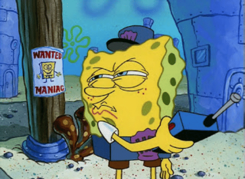
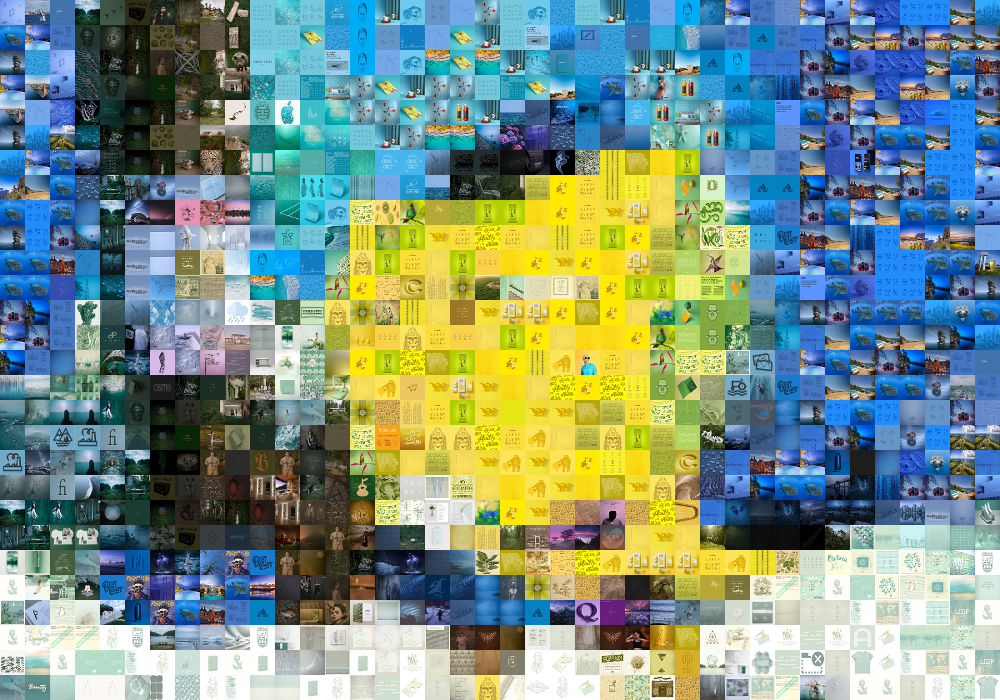

## Image Reconstitution

The Image Reconstitution project takes in a user uploaded picture, and 'redraws' it using images found from the internet.

The Reconstitution Process follows 5 steps, and uses three different programming languages, NodeJs, Java, and Golang.

Step 1: Using NodeJS, Take in a png from the user. Carried out by uploadImage.js 

Step 2: Use Java to resize the picture. The project produces the best output with an input that is larger than 1000x1000px. If it is smaller than those dimensions, then it'll be scaled up. Its width and height are then rounded to the nearest multiple of 50, in order to help with calculation purposes. Carried out by resizeImage.java.

Step 3: Use Golang to find the average color of each 25px x 25px square. Output a pixelized version of the original image. Carried out by pixelateImage.exe

Step 4: Using Java, iterate through each 25px x 25px square, extract a picture off of https://www.designspiration.com/ that has a matching color. Stitch all of the pictures together into one 'reconstituted image'. Carried out by reDrawImage.java

Step 5: Using NodeJs, display the result. Carried out by uploadImage.js

Communication between programming languages were handled by having each process output a PNG file for the next step in the process to read. 
Each step of the process is carried out production-line style by a given exe/java file.
uploadImage.js is also responsible for coordinating each program, making sure that each step is operating correctly on the proper PNG file.

## Running the Program

*Starting The Program*
1. Enter the ProjectFiles folder in Terminal/Command Prompt
2. Type `node uploadFile.js` to start the server.
3. Using a web browser, navigate to `localhost:8000`.
4. Upload a png file of your choice.
5. Image processing takes awhile, so please be patient and refresh the page periodically. You can check on the command prompt to get updates on the reconstitution. Reconstitution takes longer for bigger png files.

*\*Do note that this program relies on images pulled from a website outside of the developer's control. In the off case that reconstituted images come out looking weird, it may be an issue with https://www.designspiration.com/.*

*\**This program was developed using a system running Windows 10. Since this project relies on the terminal to call upon each step, Linux and MacOS systems may require editing the uploadImage.js file to account for the differing terminal syntax between the operating systems. In this case, the relevant lines to edit are lines 43, 57, and 70.*
*Make sure to change these lines to match with the proper terminal commands for your system.*
