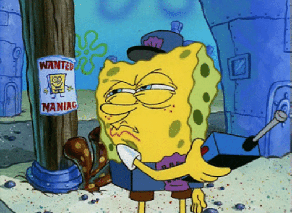

## Image Reconstitution

The Image Reconstitution project takes in a user uploaded picture, and 'redraws' it using images found from the internet.

The Reconstitution Process follows 5 steps, and uses three different programming languages, NodeJs, Java, and Golang.

Step 1: Using NodeJS, Take in a png from the user 

Step 2: Use Java to resize the picture. The project produces the best output with an input that is larger than 1000x1000px. If it is smaller than those dimensions, then it'llb be scaled up. Its width and Height are then rounded to the nearest multiple of 50, in order to help with calculation purposes.

Step 3: Use Golang to find the average color of each 25px x 25px square. Output a pixelized version of the original image.

Step 4: Using Java, iterate through each 25px x 25px square, extract a picture off of https://www.designspiration.com/ that has a matching color. Stitch all of the pictures together into one 'reconstituted image'

Step 5: Using NodeJs, display the result.

Communication between programming languages were handled by having each process output a PNG file for the next step in the process to read.

## Running the Program
*Setup*
1. Install [VirtualBox](https://www.virtualbox.org/)
2. Install [Vagrant](https://www.vagrantup.com/)

*Starting The Program*
1. Enter the project folder in Terminal/Command Prompt
2. Type `vagrant up` to start the Virtual Machine
3. Type `vagrant ssh` to enter the Virtual Machine
4. Type `cd project` to enter the VM's project folder 
5. Type `node uploadFile.js` to start the server.
6. Outside of the Virtual Machine, using a web browser, go to `localhost:8000`.
7. Upload a png file of your choice.
8. Image processing takes awhile, so please be patient and refresh the page periodically. You can check on the command prompt to get updates on the reconstruction. Reconstruction takes longer for bigger png files.

